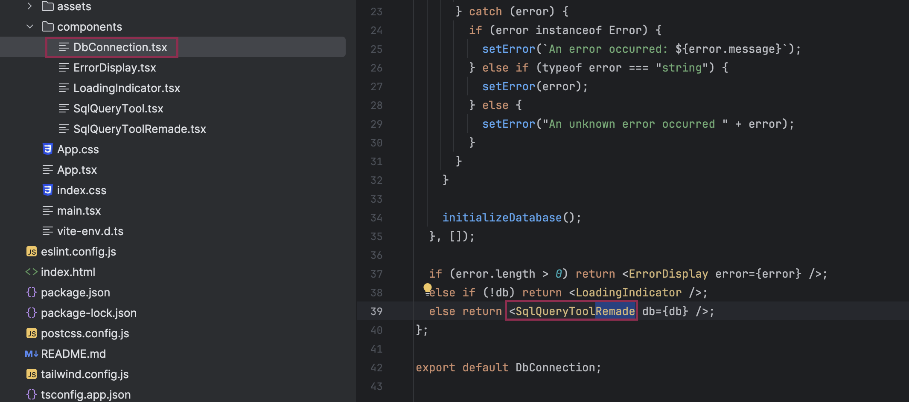

# TA_Expert_Remonta

## Test Assignment for "Эксперт Ремонта"

### How It Works

<ul>
  <li><b>Query Editor:</b> Write your SQL query in the editor and click <code>Execute Query</code> to run it.</li>
  <li><b>Results Table:</b> The results are displayed in a sortable and filterable table.</li>
</ul>

<h4>Two Modes:</h4>
<ul>
  <li><b>Server Mode:</b> Queries are processed on the backend via FastAPI.</li>
  <li><b>Client Mode:</b> Queries are executed locally using <code>sql.js</code>.</li>
</ul>

---

### How To: Client Mode with React Only

<ol>
  <li>Install dependencies:</li>
  <pre>
    <code>
cd frontend
npm install
    </code>
  </pre>
  <li>Open <code>DbConnection.tsx</code> in the <code>src</code> folder.</li>
  <li>Make sure to use the <code>SqlQueryTool</code> component for running queries locally via <code>sql.js</code>.</li>
  
<li>Start the development server:</li>
  <pre>
    <code>
npm run dev
    </code>
  </pre>
  <li>Open your browser at <a href="http://localhost:5173">http://localhost:5173</a>.</li>
</ol>

---

### How To: Server Mode with React and FastAPI

<ol>
  <li>Install dependencies:</li>
  <pre>
    <code>
cd frontend
npm install
    </code>
  </pre>
  <li>Open <code>DbConnection.tsx</code> in the <code>src</code> folder.</li>
  <li>Make sure to use the <code>SqlQueryToolRemade</code> component to connect to the FastAPI backend for query execution.</li>

<li>Start the frontend development server:</li>
  <pre>
    <code>
npm run dev
    </code>
  </pre>
  <li>Setup the backend:</li>
  <pre>
    <code>
cd ..
cd backend
pip install -r requirements.txt
    </code>
  </pre>
  <li>Start the FastAPI server:</li>
  <pre>
    <code>
uvicorn main:app --reload
    </code>
  </pre>
  <ul>
    <li>Server runs at: <a href="http://127.0.0.1:8000">http://127.0.0.1:8000</a></li>
    <li>API documentation: <a href="http://127.0.0.1:8000/docs#/default">http://127.0.0.1:8000/docs#/default</a></li>
  </ul>
  <li>Open your browser at <a href="http://localhost:5173">http://localhost:5173</a>.</li>
</ol>

---

### Tech Stack

<ul>
  <li><b>Frontend:</b> React, Material-UI, AG Grid, Monaco Editor.</li>
  <li><b>Backend:</b> FastAPI.</li>
  <li><b>Database:</b> SQLite.</li>
</ul>
